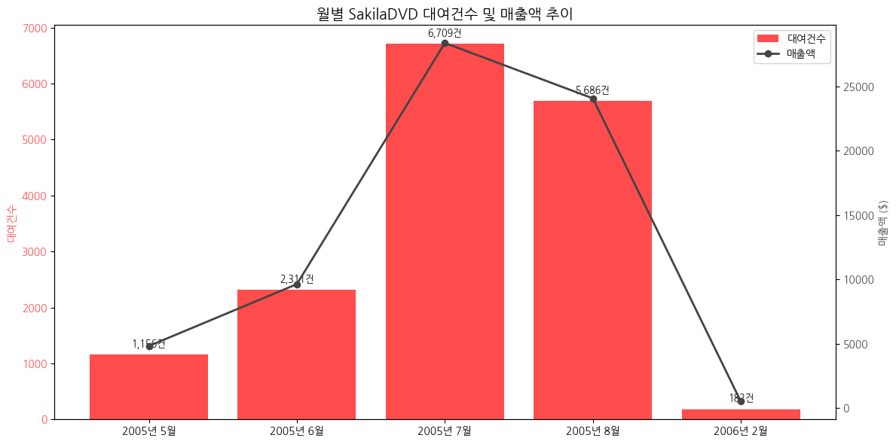
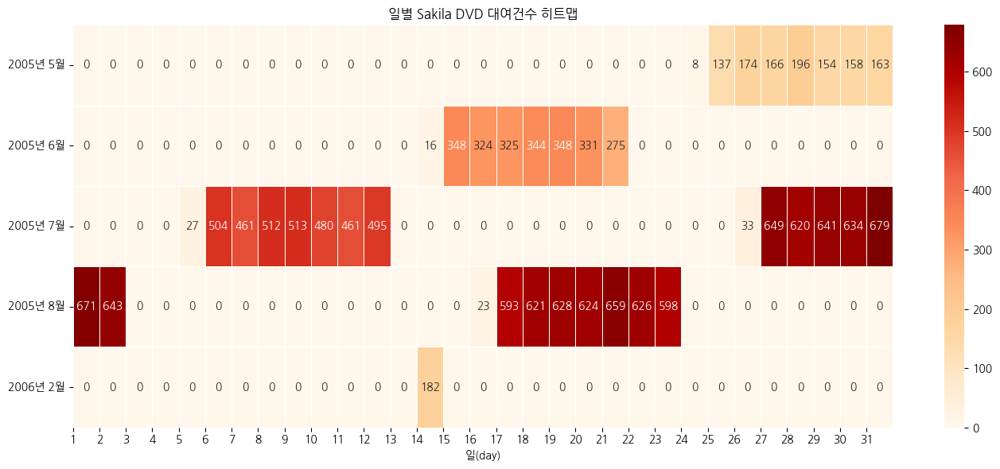
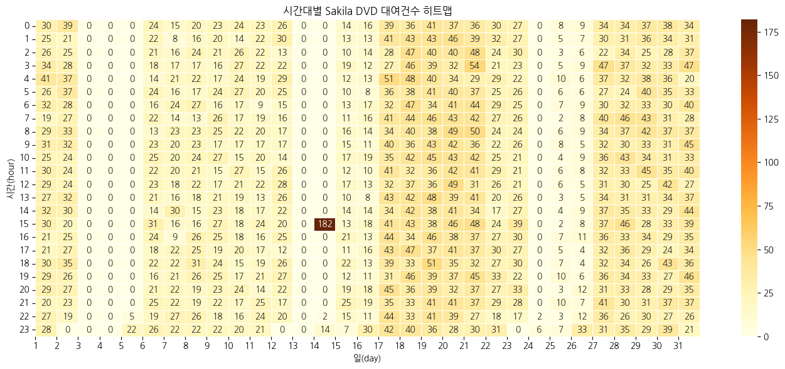
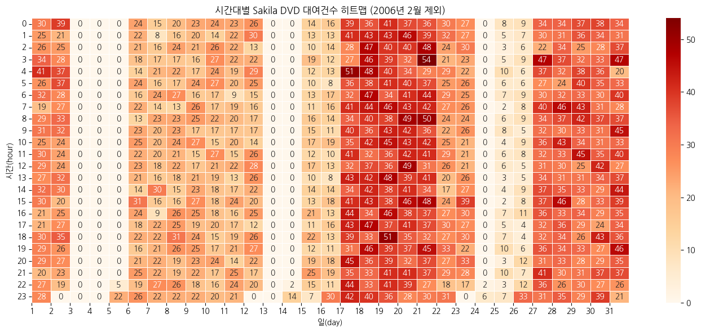
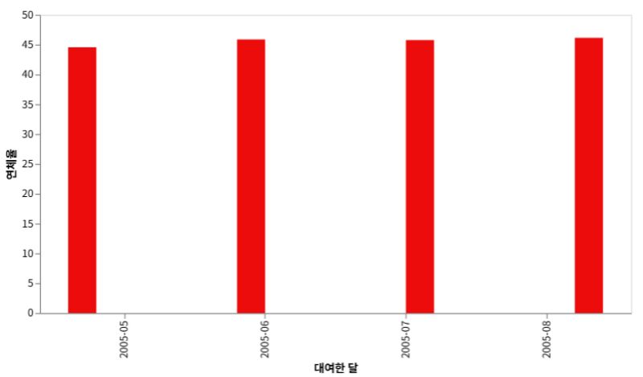
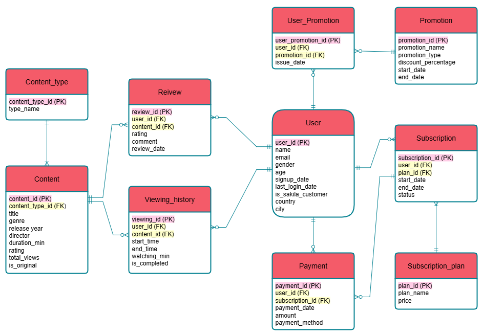
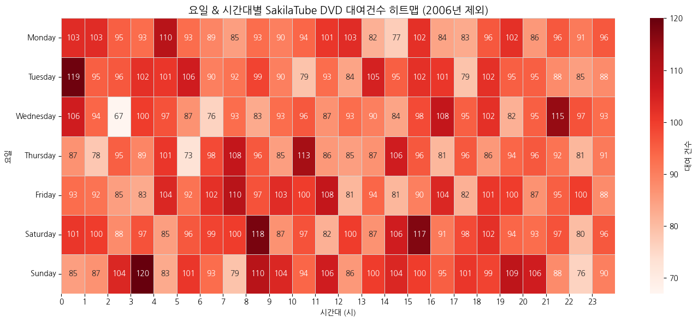
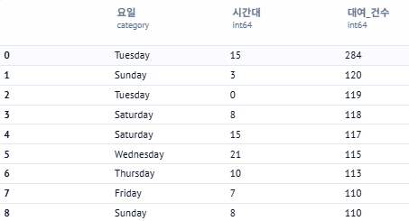

# [1] 프로젝트 개요
## 1. 배경
본 프로젝트는 Sakila그룹으로부터 의뢰받아 진행된 전략 컨설팅 프로젝트의 결과물로, 기존 DVD 대여점을 운영해온 Sakila의 비즈니스 모델을 점검하고, 디지털 컨텐츠 시장의 흐름을 맞춘 신규 OTT 서비스 'SakilaTube' 전환 전략을 제안하는 것을 목적으로 한다.

## 2. 시장 진입 필요성
2007년을 기점으로 미디어 산업은 물리적 컨텐츠 보유 중심에서 디지털 스트리밍 기반 소비 방식으로 빠르게 전환되고 있다. 특히 넷플릭스의 스트리밍 서비스 시작과 고속 인터넷 보급 호가대는 온라인 구독 기반 OTT 시장의 본격적인 성장 신호로 작용하고 있다.   

 기존 오프라인 DVD 대여 산업은 고정비 부담, 운영 제약, 수요 예측 한계 등으로 인해 수익성 악화와 경쟁 심화(Red Ocean) 상황에 놓여있다. 반면 스트리밍 기반 구독 시장은 아직 경쟁자 부재의 초기 단계(Blue Ocean)로 선제 진입 시 시장 선점을 기대할 수 있다.  

Sakila는 이미 DVD 컨텐츠와 고객 데이터를 보유하고 있으며, 이를 활용하여 신속하고 효율적인 디지털 전환이 가능하다는 점에서 OTT 시장 진입은 시기적으로 적절하며 전략적으로도 유의미한 선택이라 할 수 있다.

## 3. 컨설팅 목적
본 프로젝트의 목적은 다음과 같다.
- Sakila DVD 대여점의 구조적 문제점 진단
- OTT 전환의 타당성 확보
- 컨텐츠 전략, 마케팅 프로모션 설계 등 실행 가능한 사업 전략 수립
- 이를 통한 지속 가능한 반복 매출 구조(MRR) 기반 확보

## 4. 분석 전제
분석 수행 시 다음과 같은 가설을 수립하고 전제로 설정하였다.
- 2005년 9월 ~ 2005년 1월은 내부 재정비 기간으로 간주하여 분석에서 제외하였다.
- 2006년 2월 14일 자료가 2006년 2월 자료의 전부로 간주한다. 즉, 자료의 소실이 없었다고 본다.
- 고객 데이터는 Sakila 데이터 전체를 대상으로 층화계층 추출 방식으로 선정하여 대표성을 확보하였다고 가정한다.
- Sakila DVD 대여점은 무인매장이 아닌 유인매장이다.

# [2] 현황 분석 (AS IS)
## 1. 수요 및 매출의 불안정성
월별 대여 건수 및 매출액 추이에서 2005년 7월을 기점으로 대여 수요가 급증했다가 이후 급격히 하락하는 양상을 보이며 수요와 수익성의 변동이 매우 심함을 확인할 수 있다. 이는 고정비가 높은 오프라인 구조에서 손익분기점 달성이 어려운 구조적 리스크를 내포하고 있다.

## 2. 비효율적 영업 구조
일별 대여 건수 분석 결과 월별 절반 이상의 날에서 매출 발생이 없거나 매우 적어 매장 운영의 효율성이 낮고 자원 낭비가 빈번하게 발생하고 있다. 특히 수요가 발생하는 날이나 시간대가 불규칙하여 인력, 공간, 재고 운영의 어려움을 가중시키고 있다.

## 3. 야간 수요에 따른 추가 비용 발생
시간대별 분석 결과 대여 수요는 야간에도 높은 것을 확인할 수 있다.이는 매장을 더 오랜 시간 운영해야 하며, 결과적으로 야간 인건비 등 고정비용이 추가로 발생하는 구조이다.

## 4. 높은 연체율과 운영 부담
2005년 월별 연체율은 전월 모두 40%이상으로 나타났으며 이는 재고 회전율 저하, 고객 응대 부담 증가, 수익 손실 등 운영상 손실 요인으로 작용할 수 있다. 또한 반납 지연으로 인해 발생하는 연쇄적인 재고 부족 현상도 문제점으로 확인되었다.

## 5. 고객 편의성 측면의 한계
현재의 오프라인 대여 모델은 사용자가 매장을 방문해 직접 재고를 확인하고 대여 및 반납을 해야하는 방식으로, 편의성과 접근성이 현저히 낮고 사용자 불편이 높으며 재고 부족, 반납 지연, 방문 실패 등으로 이어지는 불만족 경험이 반복되는 구조이다.

# [3] 샤킬라튜브 비즈니스 모델 제안 (TO BE)
## 1. 비즈니스 모델 개요 : 구독기반 OTT 모델 도입
현재 Sakila가 운영중인 DVD 대여점 모델은 물리적 매장과 재고 중심의 구조로 인해 운영 시간과 인건비, 재고 관리 등에서 높은 고정비가 지속적으로 발생하고 있다. 또한 수요 예측의 어려움, 연체 문제, 불편한 사용자 경험 등으로 인해 장기적으로 지속 가능한 수익 모델을 구축하기 어려운 상황에 직면해 있다. 

이에 본 컨설팅에서는 단순한 서비스 전환을 넘어 수익성과 고객 경험을 동시에 강화할 수 있는 전략적 전환으로서 구독 기반 OTT 모델 도입을 제안한다.

이 모델은 고객 개개인의 컨텐츠 소비 성향과 이용 패턴을 반영한 차등 요금제와 자동화된 컨텐츠 제공 방식을 통해 개인화된 경험을 제공하며, 결제 구조를 구독방식으로 전환함으로써 예측 가능한 반복 매출 구조(MRR)를 설계할 수 있다. 스트리밍 서비스 특성상 물리적 재고와 매장이 필요 없어 운영 효율성이 크게 개선될 것이며, 축적된 시청 이력 데이터를 활용해 정교한 고객 마케팅과 업셀링 전략도 가능하다. 결과적으로 이는 Sakila의 기존 사업 구조를 근본적으로 혁신하고 디지털 전환 기반의 지속 가능한 수익 구조와 고도화된 고객 경험을 동시에 실현하는 전략이라고 볼 수 있다.

## 2. ERD 기반 시스템 설계
전환된 OTT 서비스 운영을 위한 데이터 구조(ERD)에서 주요 테이블은 다음과 같다.
- 구독 관리 및 수익 추적 : `User`, `Subscription`, `Subscription_plan`, `Payment`
- 컨텐츠 소비 데이터 기반 개인화 : `Content`, `Viewing_history`, `Review`
- 마케팅 요소 연계 : `Promotion`, `User_Promotion`

이 구조를 통해 사용자 행동, 결제 이력, 시청 이력 등을 모두 추적 가능하며 데이터 기반 운영 및 마케팅 고도화가 가능하다.

## 3. 핵심 성과지표 : MRR 정의 및 구현
- MRR(Monthly Recurring Revenue) : 유효 구독자들이 매달 납부하는 구독 요금의 총합으로, 단발 매출이 아닌 지속 가능한 수익성을 측정하는 핵심 지표이다.
- MRR = 신규 MRR + 업그레이드 MRR - (다운그레이드 MRR + 이탈 MRR)
- 적용 기준 
    - `Subscription.status` IN (`active`, `upgraded`, `downgraded`)
    - `start_date` ≤ 현재 ≤ `end_date`
- 실현 방식 : ERD 내 `Subscription` 및 `Subscription_plan` 테이블 활용하여 자동화된 MRR 추적

# [4] 실행 전략 (Action Item)
## 1. SakilaTube의 차별화 포지셔닝
SakilaTube는 짧고 몰입도 높은 컨텐츠 구성, 데이터 기반 큐레이션, 오리지널 컨텐츠 중심 전략, 유튜버와의 합작 컨텐츠를 통해 범용성과 전문성을 동시에 갖춘 플랫폼으로 자리매김하고자 한다.
- 넷플릭스는 긴 러닝타임 중심, 유튜부는 검증되지 않은 UCC 중심으로 컨텐츠의 피로도가 높고 만족도가 분산되는 경향이 있다.
- SakilaTube는 20분 이내의 짧은 컨텐츠와 몰아보기 컨텐츠를 제공해 바쁜 현대인의 시청 습관에 최적화되었다

## 2. 큐레이션 컨텐츠 전략
SakilaTube는 자체 보유한 Sakila DVD 데이터를 기반으로 다양한 주제의 큐레이션 컨텐츠 시리즈를 운영함으로써 사용자의 관심과 체류 시간을 늘리고자 한다.
- 최애 배우 특별전 : 가장 많은 영화에 출연한 배우들 별 인기 작품 묶음 제공
- 꺼진 영화도 다시보자전 : 2005년 영화들을 카테고리화 하여 상위 5개의 카테고리 선정 후 가장 대여를 많이 한 2개의 영화를 각 카테고리별로 선정
- 바쁘다 바빠 현대사회전 : 러닝타임이 1시간 미만인 영화들 중 인기 많은 영화 10선 선정

## 3. 오리지널 컨텐츠 전략
SakilaTube는 경쟁사와 차별화된 오리지널 컨텐츠 제작을 통해 브랜드 정체성과 컨텐츠 경쟁력을 동시에 확보하고자 한다
- 한미합작 드라마 < CROSS > : 국가 간 문화적 교류 형성 위해 최애 애부 특별전을 열었던 배우 5명이 모두 출연하는 한미합작 드라마 제작 계획
- 1시간 몰아보기 시리즈 : 영화, 드라마, 리얼리티 장르별로 1시간동안 몰아볼 수 있는 컨텐츠 구성
- 유튜버 합작 컨텐츠 : 플랫폼 초기 활성화를 위한 유튜버와의 합작 컨텐츠 기획

## 4. 구독자 유치를 위한 프로모션 전략
SakilaTube는 신규 사용자 확보를 위해 60일 무료 체험 전략을 도입한다. 이는 초기 진입 장벽을 낮추고 서비스 경험을 유도함으로써 자연스러운 구독 전환을 이끌어낼 것이다. 특히 컨텐츠 큐레이션과 오리지널 컨텐츠가 결합된 플랫폼 경험은 체험기간 내 구독자의 만족도를 끌어올려 장기적인 고객 유지율 향상으로 이어질 것으로 기대된다.

## 5. 요금제 전략 : 차등 구독 시스템 설계
2007년의 케이블TV 요금제를 참고하여 3단계 차등 요금제를 도입함으로서 고객의 컨텐츠 수요와 지불 의사에 따라 유연한 구독 옵션을 제공한다.
- Basic : 무료, 기본 컨텐츠만 제공
- Standard : 오리지널 컨텐츠를 제외한 대부분의 컨텐츠 제공
- Premium : 오리지널 컨텐츠를 포함한 전체 컨텐츠 제공

이 구조는 고객군 세분화, 업셀링 유도, MRR 극대화 측면에서 효과적인 모델로 작용할 수 있을 것이다.

## 6. 사용자 행동 기반 운영 전략 : 피크타임 집중 분석
기존 DVD 대여 데이터를 바탕으로 요일 및 시간대별 대여 패턴을 분석한 결과, 특정 요일과 시간대에 수요가 집중되는 피크타임이 존재함을 확인하였다. 이에 따라 피크타임에 맞춰 신규 컨텐츠 런칭 및 푸시 알림 등의 마케팅 전략을 수행함으로써 컨텐츠 소비 활성화를 달성하고자 한다.

# [5] 기대 효과 및 결론
본 프로젝트를 통해 제안된 SakilaTube 전환 전략은 단순한 서비스의 변화가 아닌, 플랫폼 기반 비즈니스 모델로의 근본적 전환을 의미한다. 이 전략이 시행됨으로써 다음과 같은 효과를 기대해 볼 수 있다.

- MRR 기반의 안정적인 수익 구조 확보  
: 구독 중심의 반복 매출 모델을 통해 예측 가능한 재무 흐름을 구축하고, 신규 및 기존 고객 모두를 대상으로 수익을 지속적으로 창출할 수 있다.

- 운영비 절감 효과  
: 물리적 매장, 재고, 인건비 등의 고정비가 제거되며, 디지털 중심의 효율적인 운영체계로 전환함에 따라 전체적인 비용 구조가 최적화된다.

- 고객 맞춤 컨텐츠 경험 강화  
: 시청 데이터 기반 큐레이션, 오리지널 컨텐츠 등 다양한 포맷을 통해 고객의 취향에 부합하는 컨첸츠 제공이 가능하며, 이는 곧 사용자 만족도와 충성도 향상으로 이어질 것이다.